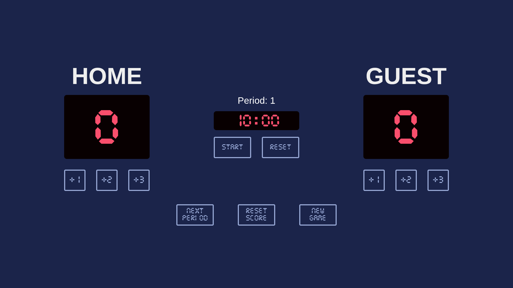

# Basketball Scoreboard

A responsive, interactive basketball scoreboard with game management features.

## Features

- **Dual Team Scoring**: Track points for both HOME and GUEST teams
- **Multiple Scoring Options**: Add 1, 2, or 3 points with dedicated buttons
- **Period Tracking**: Display and manage game quarters/periods
- **Game Timer**: Digital countdown with minutes and seconds display
- **Timer Controls**: Start/pause/resume functionality for game management
- **Reset Options**:
    - Reset scores while maintaining period and timer
    - Reset timer only
    - Complete game reset (scores, period, and timer)
- **Custom Typography**: Special basketball-style font for authentic look

## Live Demo

[View Live Demo](https://basketball-scoreboard-23.netlify.app/)

## Preview

## How It Works

1. The scoreboard initializes with zeros for both teams
2. Point buttons add the corresponding value to the selected team's score
3. The timer can be controlled independently with start/pause/resume functionality
4. Period advancement automatically resets scores but maintains timer settings
5. Various reset options provide flexibility for different game scenarios