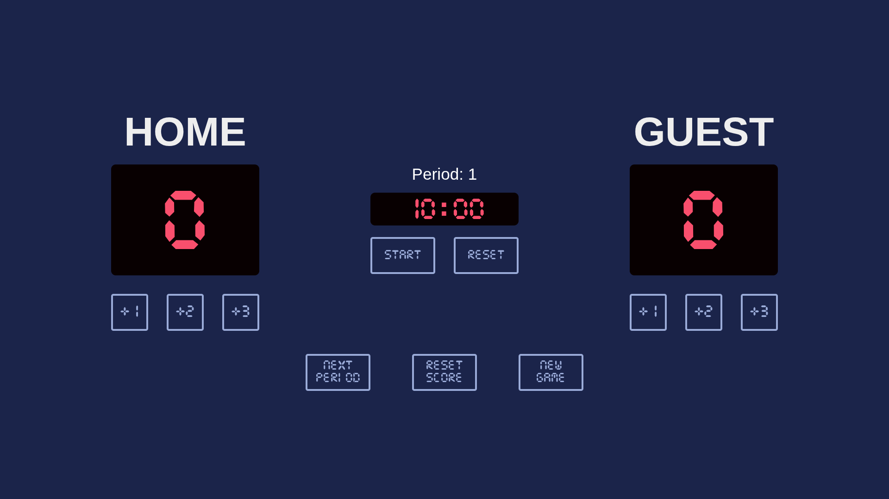

# Basketball Scoreboard

A responsive, interactive basketball scoreboard built with HTML, CSS, and JavaScript. This project was developed as part of the Scrimba Frontend Developer Path.

## Features

### Score Tracking

- Keep track of scores for both HOME and GUEST teams
- Add points in increments of +1, +2, or +3 with dedicated buttons for each team

### Game Period Management

- Display and track the current period (quarter) of the game
- "Next Period" button to advance to the next period and reset the scores
- "New Game" button to completely reset the game (scores, period, and timer)

### Game Timer

- Digital countdown timer displaying minutes and seconds (10:00 format)
- Multi-function START/PAUSE/RESUME button:
  - START: Begin the countdown timer
  - PAUSE: Temporarily stop the timer
  - RESUME: Continue the timer from where it was paused
- RESET button to restore the timer to its initial value (10:00)

### Score Management

- "Reset Score" button to zero out both team scores while maintaining period and timer

## How to Use

1. Open the `index.html` file in any modern web browser
2. Use the +1, +2, and +3 buttons to add points to either team
3. Control the game timer with the Start/Pause/Resume and Reset buttons
4. Advance to the next period using the Next Period button
5. For a complete restart, use the New Game button

## Screenshot
