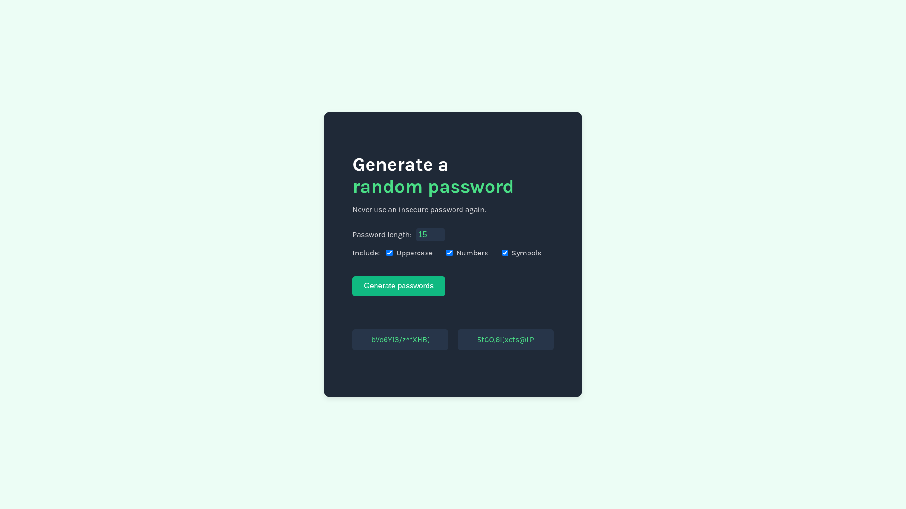

# Random Password Generator

A sleek, modern password generator that creates secure, customizable passwords with a click.



## Features

- **Generate Two Passwords Simultaneously**: Create two random passwords at once
- **Customizable Password Length**: Choose any length from 6 to 30 characters (default: 15)
- **Character Type Options**: 
  - Toggle uppercase letters
  - Toggle numbers
  - Toggle special symbols
- **One-Click Copy**: Copy any generated password to clipboard with a single click
- **Visual Feedback**: Confirmation message appears when a password is copied
- **Responsive Design**: Works on desktop and mobile devices

## Technologies Used

- HTML5
- CSS3
- JavaScript (ES6+)
- Google Fonts (Karla)

## How It Works

1. The app generates random passwords using JavaScript's Math.random() function
2. Users can customize their passwords by:
   - Adjusting the password length
   - Selecting which character types to include (lowercase always included)
3. When the "Generate passwords" button is clicked, two unique passwords are created
4. Clicking on a password copies it to the clipboard using the Clipboard API

## Code Structure

- **index.html**: Main HTML structure and UI elements
- **index.css**: Styling and responsive design
- **index.js**: JavaScript logic for password generation and clipboard functionality

## Technical Implementation

The password generation algorithm:

```javascript
function generateRandomPassword() {
    let password = "";
    const charSet = getCharacterSet();
    const passwordLength = parseInt(passwordLengthEl.value) || DEFAULT_PASSWORD_LENGTH;
    
    for (let i = 0; i < passwordLength; i++) {
        const randomIndex = Math.floor(Math.random() * charSet.length);
        password += charSet[randomIndex];
    }
    
    return password;
}
```

## Security Considerations

- All password generation happens locally in the browser
- No passwords are stored or transmitted

## Installation

No installation required! Simply open the index.html file in any modern web browser.

## Credits

- Part of the Scrimba Frontend Developer Path
- Font: [Karla](https://fonts.google.com/specimen/Karla) from Google Fonts