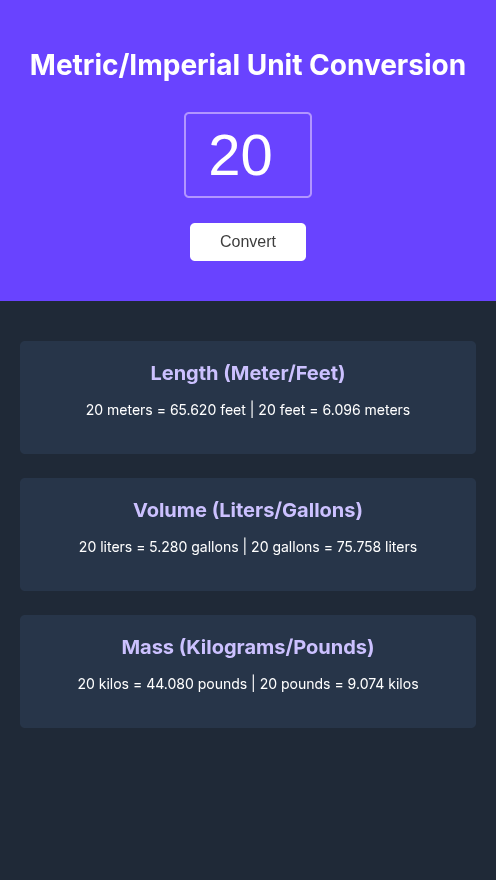

# Metric/Imperial Unit Converter

A clean, responsive web application that converts between metric and imperial units.



## Features

- **Instant Conversions**: Convert between metric and imperial units with a single click
- **Multiple Unit Types**: Support for length (meters/feet), volume (liters/gallons), and mass (kilograms/pounds)
- **Bidirectional Conversion**: Shows conversions in both directions simultaneously
- **Sleek Dark Mode**: Modern UI with a dark theme for better visibility
- **Custom Input**: Enter any value to convert
- **Precise Results**: All conversion values rounded to three decimal places
- **Responsive Design**: Works well on all device sizes

## Technologies Used

- HTML5
- CSS3
- JavaScript (ES6+)
- Google Fonts (Inter)

## How It Works

1. The app initializes with a default value (20)
2. Users can enter any numeric value in the input field
3. Clicking the "Convert" button triggers all conversion calculations
4. Six conversion results are displayed in three categories
5. Each section shows both metric-to-imperial and imperial-to-metric conversions

## Code Structure

- **index.html**: Main HTML structure and UI elements
- **index.css**: Styling with dark theme and responsive design
- **index.js**: JavaScript logic for handling conversions

## Technical Implementation

The conversion logic uses predefined formulas for accuracy:

```javascript
function convertUnits() {
    const inputValue = Number(inputEl.value)

    // Length conversions
    const metersToFeet = (inputValue * 3.281).toFixed(3)
    const feetToMeters = (inputValue / 3.281).toFixed(3)

    // Volume conversions
    const litersToGallons = (inputValue * 0.264).toFixed(3)
    const gallonsToLiters = (inputValue / 0.264).toFixed(3)

    // Mass conversions
    const kilosToPounds = (inputValue * 2.204).toFixed(3)
    const poundsToKilos = (inputValue / 2.204).toFixed(3)

    // Update DOM elements with conversion results
    lengthEl.textContent = `${inputValue} meters = ${metersToFeet} feet | ${inputValue} feet = ${feetToMeters} meters`
    volumeEl.textContent = `${inputValue} liters = ${litersToGallons} gallons | ${inputValue} gallons = ${gallonsToLiters} liters`
    massEl.textContent = `${inputValue} kilos = ${kilosToPounds} pounds | ${inputValue} pounds = ${poundsToKilos} kilos`
}
```

## Installation

No installation required! Simply open the index.html file in any modern web browser.

## Credits

- Part of the Scrimba Frontend Developer Career Path
- Font: [Inter](https://fonts.google.com/specimen/Inter) from Google Fonts
