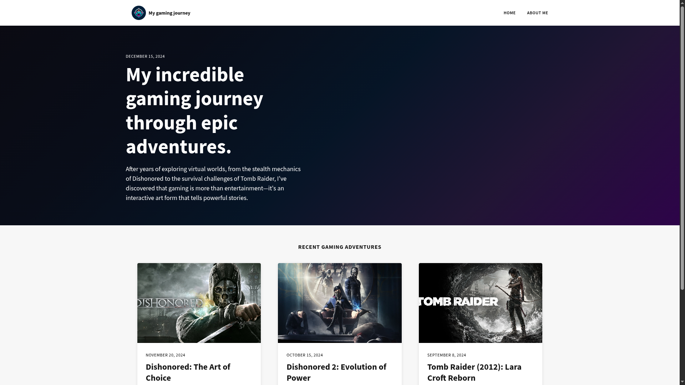

# Solo Project: My Gaming Journey

A personal gaming timeline showcasing my journey through various video games and gaming milestones, built with responsive design principles.

## Features

- **Personal Gaming Timeline**: Chronological display of gaming experiences and milestones
- **Responsive Design**: Fully responsive layout that works on all device sizes
- **Interactive Elements**: Hover effects and smooth transitions between sections
- **Mobile-First Approach**: Optimized for mobile viewing with progressive enhancement

## Technologies Used

- HTML5
- CSS3
- JavaScript (for interactive elements)
- CSS Grid & Flexbox
- Media Queries
- CSS Animations

## Credits

- Part of the Scrimba Frontend Developer Career Path
- Personal gaming content and experiences
- Images sourced from web search
