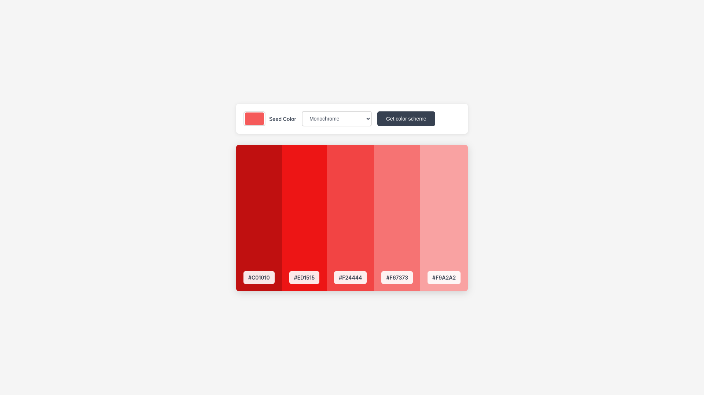

# Color Scheme Generator

A color scheme generator that helps designers and developers create harmonious color palettes using The Color API.

## Features

- **Seed Color Selection**: Choose any color as your starting point using a color picker
- **Multiple Scheme Modes**: Generate schemes using monochrome, analogic, complement, triad, and quad algorithms
- **Responsive Design**: Works on desktop and mobile devices
- **Copy to Clipboard**: Click any hex value to copy it to clipboard

## Technologies Used

- HTML5
- CSS3
- JavaScript (ES6+)
- The Color API
- Fetch API
- Clipboard API

## How It Works

1. User selects a seed color using the color picker
2. User chooses a color scheme mode from the dropdown
3. App makes API request to The Color API with the selected parameters
4. Generated color palette is displayed with hex values
5. Users can copy hex values by clicking on them

## Installation

No installation required! Simply open the index.html file in any modern web browser.

## Credits

- Part of the Scrimba Frontend Developer Career Path
- Uses [The Color API](https://www.thecolorapi.com/) for color scheme generation